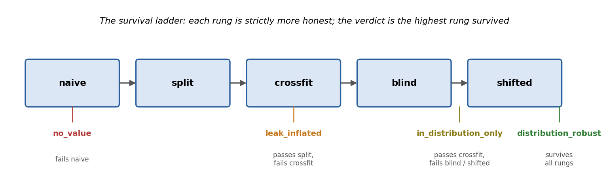
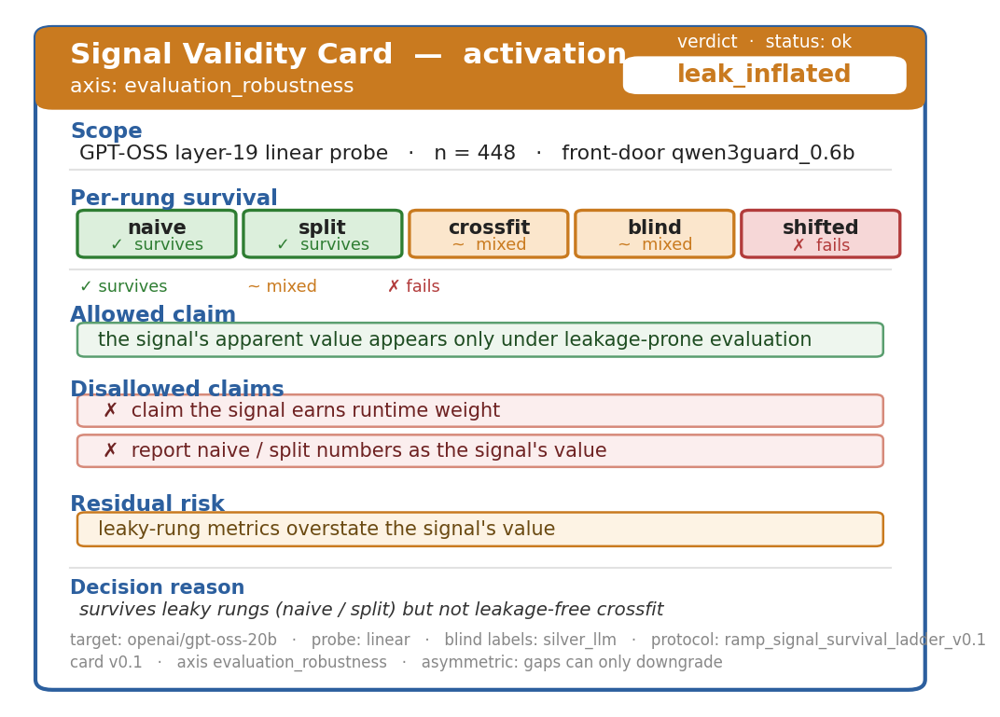
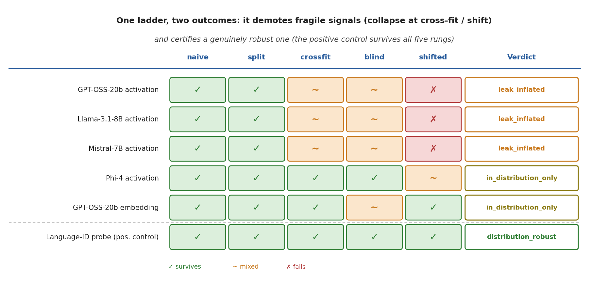
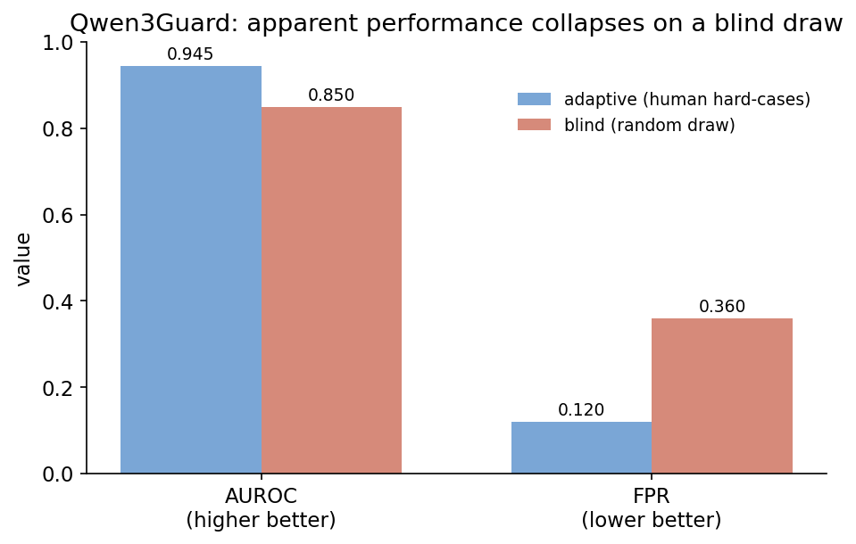
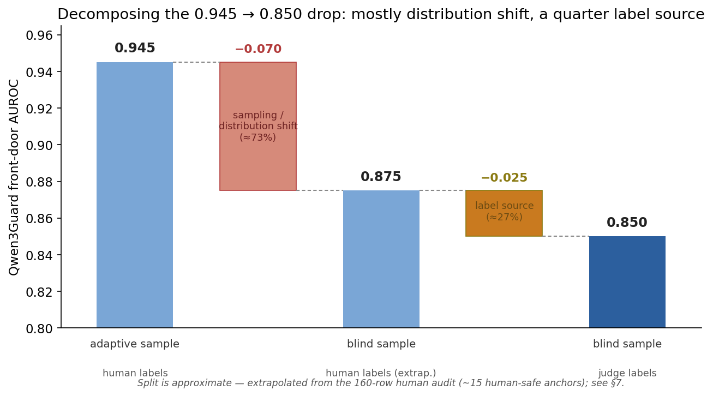
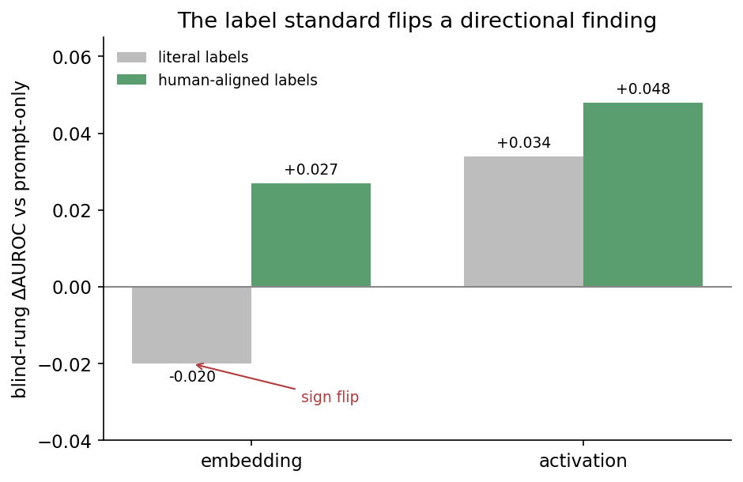

# Apparent Signal Value Is an Evaluation Artifact: A Robustness Audit for Safety Signals

**RAMP — Robustness Audit for Monitoring Probes**

*Draft v1. Numbers from `docs/fragility-study-results-v0_1.md`, `docs/fragility-study-results-v0_2.md` (multi-model generalization, positive control, confound decomposition), and `docs/external-guard-audit-results-v0_1.md` (single-provenance guard audit); protocol in `docs/fragility-study-design.md`; card standard in `docs/signal-validity-card-spec-v0_1.md`.*

---

## Abstract

Safety pipelines increasingly gate on a learned signal — an activation probe, an embedding-risk score, a guard classifier — and report a single AUROC as evidence it works. We show that this apparent value is largely an artifact of *how the signal was evaluated*. We introduce RAMP, a pre-registered robustness audit: a **survival ladder** that re-tests a signal under progressively honest conditions (leakage-free cross-fitting, blind independently-labeled evaluation, and a shift to a new distribution) and emits a scoped **Signal Validity Card** whose every protocol gap resolves against the stronger claim. RAMP first audits its *own* internal signals and demotes them: an activation probe that looks strong under leaky protocols is `leak_inflated` (it fails cross-fitting), and an embedding signal is only `in_distribution_only`. It then audits *published* guards, including the one it is built on. Qwen3Guard's AUROC falls from 0.945 on an adaptively-mined hard-case set to 0.850 on a blind random draw, and a threshold frozen on the former yields ~36% false positives on the latter; a larger dedicated guard (Llama Guard 4 12B) misses 38% of human-labeled unsafe hard cases; and a frontier model used as a guard posts a near-perfect blind AUROC (0.976) that we show is a label-source confound, not a win. Underlying all of it, apparent value depends on the **label standard**, not just the protocol: blind LLM-judge labels that agreed with each other almost perfectly (Cohen's κ 0.89, literal rubric) failed a human audit (κ 0.19–0.29) and reversed a directional signal-ranking result; only a human-aligned rubric, independently validated to substantial human agreement (κ 0.62), gives the corrected ranking. The contribution is the audit protocol and the validity-card standard — a way to state what a safety signal's number does and does not license — not a new classifier.

---

## 1. Introduction

A growing class of AI-safety methods reduces to a *signal*: a number, computed from a prompt or from a model's internal state, that is supposed to indicate unsafe behavior. Activation probes read the residual stream (Zou et al., 2023; Arditi et al., 2024); embedding-risk scores measure proximity to harmful clusters; guard classifiers (Llama Guard, Inan et al., 2023; Qwen3Guard, Zhao et al., 2025) score the text directly. In each case the evidence offered is the same: a single AUROC on one dataset. If the number is high, the signal is treated as ready to gate, route, or block.

This paper makes one claim: **that number is largely an artifact of how the signal was evaluated, and under honest re-evaluation much of it does not transfer.** A signal that scores 0.95 in the lab can be reading a giveaway in its own evaluation set, can have had its hyperparameters chosen on the data it is scored on, can be measured against labels that do not match human judgment, or can simply be tested on a distribution easier than the one it will face. None of these is exotic; all of them inflate the headline number; and none is visible from the number itself.

**A shipped instance of the problem.** This is not a hypothetical concern. In its GPT-5.6 Preview System Card (OpenAI, 2026), OpenAI describes a hierarchical safety-monitoring system used to gate deployment — including newly added activation-based classifiers, on two of the three models, that watch the model's internal state and can pause generation for a separate safety check before any output is released — and reports the system's effectiveness as a single end-to-end recall on an evaluation set (94.8% on biology, 81.6% on cybersecurity). The activation classifier is one component of this system, not a standalone blocker, which limits how far any one component's evaluation can be read in isolation. But the reporting convention is the one RAMP addresses: a learned safety signal embedded in a pipeline whose reported value is a single aggregate number, with no public account of whether that number survives leakage-free re-derivation, independently-sourced labels, or a shift in distribution. We are not claiming the system is invalid — the evidence to certify it as evaluation-robust does not exist publicly, and its absence is not proof of absence. It is the gap RAMP is built to close: an end-to-end recall reported without the robustness account licenses less than it appears to.

We introduce **RAMP**, a robustness audit for safety signals. RAMP does not propose a better signal. It proposes a way to find out whether a signal's reported value survives honest evaluation, and a standard way to report the answer. The core is a pre-registered **survival ladder** that re-runs the signal under progressively harder conditions, and a **Signal Validity Card** that records the highest rung the signal survives and scopes the claim accordingly — every protocol gap resolving against the stronger claim, so the card can only ever *downgrade*.

We exercise RAMP in two passes that mirror each other. First it audits its **own** internal signals — the activation probe and embedding score it was built around — and demotes them. Then it audits **published** guards, including Qwen3Guard, the guard RAMP itself depends on. The headline is visceral: Qwen3Guard's AUROC drops from 0.945 on an adaptively-mined hard-case set to 0.850 on a blind random draw, and a threshold frozen on the first gives ~36% false positives on the second. We then show the same fragility for a larger guard and a frontier guard, and — the cross-cutting result — that *which signal looks good* depends not only on the protocol but on the **label standard** used to score it.

**Contributions.**
1. The **survival ladder** and the **Signal Validity Card** standard: a pre-registered, fail-safe protocol and report for safety-signal robustness (§2).
2. A **self-audit** that demotes RAMP's own signals (`leak_inflated`, `in_distribution_only`), validating the method on signals we control (§3).
3. An **external audit** of published guards showing apparent value is an evaluation artifact even for shipped tooling (§4).
4. The **label-standard finding**: apparent value, and even the *ranking* of which signal helps, depends on the labeling rubric; LLM-judge labels can share a bias against human judgment that mutual agreement does not detect (§5).

---

## 2. The survival ladder and the Signal Validity Card

### 2.1 The ladder

RAMP takes a signal — anything that emits a per-example score with a ground-truth label — and runs it up an ordered ladder of evaluation conditions, each strictly more honest than the last:

- **naive** — in-sample fit and score (the optimistic baseline).
- **split** — a held-out test split (catches memorization of specific examples).
- **crossfit** — the signal is *re-derived inside each fold* (catches selection leakage: hyperparameters or layers chosen by peeking at the eval set).
- **blind** — evaluation against labels generated *independently* of the signal's own pipeline (catches label leakage and experimenter bias). When labels are produced by an LLM judge, RAMP additionally requires **judge/model separation**: the same model may not be both the model under test and the judge for that test. A guard can be evaluated against a different judge, or against benchmark-native/human labels, but not against its own judgments.
- **shifted** — evaluation on a different distribution from the one the signal was built on (catches in-distribution overfitting).

A signal's value at each rung is reported as a delta (Δ) against a fixed baseline on the same rung, with paired-bootstrap 95% confidence intervals on the out-of-distribution rungs (`blind`, `shifted`). The verdict is the **highest rung the signal survives**:

- `no_value` — does not beat baseline even at `naive`.
- `leak_inflated` — passes `naive`/`split` but not `crossfit`; its strength was leakage.
- `in_distribution_only` — survives `crossfit` but not both out-of-distribution rungs.
- `distribution_robust` — survives `crossfit`, `blind`, and `shifted`.
- `insufficient_protocol` — a rung needed for the candidate tier is missing or pending; the verdict is capped at the highest supported tier.

*(Figure 1: the survival ladder. Each rung is a gate; failing or skipping one caps the verdict at the rung below.)*

### 2.2 The Signal Validity Card

The output is not a label but a scoped card. It records the signal under test, the target model, the sample size, the per-rung deltas and CIs, the verdict, and — the point of the card — the **allowed** and **disallowed** claims and the residual risks. The card is **deliberately asymmetric**: a missing or weak rung, or unvalidated labels, can only *downgrade* the verdict or *cap* a claim, never upgrade it. The card format is axis-parameterized so independent validity layers can emit interoperable cards: RAMP fills the `evaluation_robustness` axis; a causal-validity tool fills `causal_sufficiency` for the same signal. The two interoperate by a versioned spec, not shared code.

*(Figure 2: a Signal Validity Card. RAMP's activation probe, `evaluation_robustness` axis: the verdict `leak_inflated` is color-coded, each rung is marked survives / mixed / fails, and the card scopes exactly which claims the number does and does not license.)*

---

## 3. Self-audit: RAMP's own signals

Before turning the ladder outward, we run it on the signals RAMP was built around — a linear activation probe over GPT-OSS hidden states and an embedding-cluster risk score — measured as a delta over a prompt-only baseline. This is the method-validation leg: if the ladder is sound, it should demote even our own signals where they are weak.

It does. Table 1 gives the survival table.

**Table 1. Survival table (ΔAUROC vs prompt-only, same rung).** `*` = paired-bootstrap 95% CI excludes zero; `ns` = CI includes zero.

| Signal | naive | split | crossfit | blind | shifted | Verdict |
| --- | --- | --- | --- | --- | --- | --- |
| embedding | +0.017 | +0.018 | +0.017 | −0.020 (ns) | +0.006 (ns) | `in_distribution_only` |
| activation | +0.054 | +0.052 | +0.016 (mixed) | +0.034* (mixed) | −0.011 (ns) | `leak_inflated` |
| full_fusion | +0.055 | +0.053 | +0.021 | −0.020 (ns) | +0.002 (ns) | `in_distribution_only` |

The activation probe is the cautionary case: a large apparent lift under leaky protocols (+0.054 naive) that collapses to "mixed" under cross-fitting and fails under shift. Its honest verdict is `leak_inflated` — most of its apparent value was selection leakage, not signal.

**Hardening: the weak-probe objection.** Re-running the full ladder with an MLP activation probe (one hidden layer) instead of the linear probe leaves the verdicts unchanged (activation still mixed at crossfit, significant-but-mixed on blind, failing under shift). The findings are not an artifact of using a weak linear probe.

**The demotion generalizes across model families.** To check that the activation probe's collapse is not specific to GPT-OSS, we extracted layer activations from three further open models spanning distinct families and scales — Llama-3.1-8B (Meta), Mistral-7B (Mistral), and Phi-4-14B (Microsoft) — on the same prompts, and ran each through the same ladder against the same prompt-only baseline and labels (only the activation source changes). In every case the probe reaches a near-identical in-distribution AUROC (~0.96–0.97), yet none earns `distribution_robust`: at each model's best honest (cross-fit-selected) layer the verdict is `leak_inflated` for Llama, Mistral, and GPT-OSS and `in_distribution_only` for Phi-4 — never higher — and no probe survives the `shifted` (new-distribution) rung. The precise tier between `leak_inflated` and `in_distribution_only` is layer-sensitive: it turns on a sub-0.002 cross-fit F1 difference, well inside per-split noise, and moving to the next probed layer flips Llama and Mistral from `leak_inflated` to `in_distribution_only` — so we do not read the tier as a per-model property. The robust, model-independent finding is the ceiling: across four families and 7–20B parameters, an activation probe's apparent in-distribution value does not survive the same robustness audit — on this labeled benchmark and against silver blind labels (§5, §7).

**A positive control: the ladder certifies, not only demotes.** A demotion tool is only trustworthy if it also awards its top verdict when a signal genuinely deserves it — otherwise `leak_inflated` could merely mean the bar is unreachable. So we ran the *same kind* of object — a logistic probe on a small model's mean-pooled mid-layer activations, with the identical pooling recipe — on a deliberately robust target: language identification (English vs Spanish) across the 18 parallel domains of the MASSIVE corpus, against a weak character-fraction baseline. Here the probe survives every rung, including leakage-free cross-fitting and a held-out domain, beating the baseline by ΔAUROC ≈ +0.23 with bootstrap-significant out-of-distribution lifts, and the card returns `distribution_robust`. Same machinery, opposite verdict — the ladder discriminates a robust signal from a fragile one, so its demotions are not an artifact of an unreachable bar. Two caveats keep the claim honest: this is a *certification-capability* control, not a clean one-variable swap — language ID is near-perfectly and domain-invariantly decodable even from surface text, and the setup differs from the safety audit in more than the target (objective labels, dataset, model scale) — so it shows the instrument *can* certify, not that activations beat cheap features.

*(Figure 3: the same ladder, six signals. It demotes every fragile activation probe — four model families collapse at cross-fit or shift to `leak_inflated`/`in_distribution_only` — while certifying the language-ID positive control as `distribution_robust` for surviving all five rungs.)*

---

## 4. External audit: published guards

We then point the same audit at guards that are actually shipped — including Qwen3Guard, the prompt-risk backend RAMP itself is built on. We audit our own dependency first, on purpose: the most credible demonstration that apparent value is fragile is to break the number we rely on.

### 4.1 The central fragility result

Table 2 reports each guard as a front-door classifier, AUROC on an adaptively-mined hard-case set (human-labeled) versus a blind random draw (independently labeled). We enforce judge/model separation throughout: Qwen3Guard is evaluated against human or Claude-labeled rows, Gemini-as-guard is evaluated against Claude-labeled rows rather than Gemini labels, and Llama Guard is evaluated against non-Llama labels. Gemini relabels are used only for inter-judge agreement checks, not as the scoring labels for Gemini-as-guard.

**Table 2. Front-door AUROC, adaptive vs blind.**

| Guard | AUROC adaptive | AUROC blind |
| --- | ---: | ---: |
| Qwen3Guard 0.6B | 0.945 | 0.850 |
| Gemini 2.5 Pro (as guard) | 0.791 | 0.976 |

*The higher Gemini blind number is a label-source confound, not better detection: the blind labels are themselves frontier-LLM (Claude) judgments, which a frontier model matches via shared method variance. It is not a win — see §4.3.*

Qwen3Guard's apparent AUROC falls from **0.945 to 0.850** moving from the adaptive hard-case set to a blind random sample, and on the underlying prompt-only operating point a threshold frozen on the adaptive set yields **~36% false positives** on blind data (FPR 0.12 → 0.36). The number you would have published from the adaptive set materially overstates the number you would get on a blind random draw. (§7 decomposes this drop into a dominant sampling/distribution-shift component and a smaller label-standard component.)

*(Figure 4: Qwen3Guard's apparent performance, adaptive vs blind — AUROC and FPR.)*

*(Figure 5: decomposing the 0.945 → 0.850 drop. Most of the fall (≈73%) is genuine sampling/distribution shift from the adaptive hard-case set to a blind random draw; a smaller share (≈27%) is the label-source change from human to judge labels. The middle anchor is extrapolated from the 160-row human audit; see §7.)*

### 4.2 Bigger is not better

A larger dedicated guard does not fix this. At its own operating point, **Llama Guard 4 12B misses 38% of unsafe prompts** on the human-labeled hard-case set (recall 0.623, FPR 0.048), while the 0.6B Qwen3Guard recalls 0.973 at FPR 0.133. Scaling the guard traded recall for precision, not fragility for robustness.

**Table 2b. Guard operating points (binary verdict at each guard's own threshold).**

| Set | Guard | Recall | FPR | F1 |
| --- | --- | ---: | ---: | ---: |
| Adaptive (human) | Llama Guard 4 12B | 0.623 | 0.048 | 0.752 |
| Adaptive (human) | Qwen3Guard 0.6B | 0.973 | 0.133 | 0.941 |
| Blind (judge) | Llama Guard 4 12B | 0.925 | 0.207 | 0.827 |
| Blind (judge) | Qwen3Guard 0.6B | 1.000 | 0.360 | 0.786 |

Qwen3Guard's blind FPR of 0.360 is the ~36% referenced in §4.1.

### 4.3 The frontier-guard confound

A frontier general model used as a guard (Gemini 2.5 Pro) posts a near-perfect **blind AUROC of 0.976** — and a much *worse* 0.791 on the human-labeled adaptive set. This is not a win: the blind labels are themselves frontier-LLM (Claude) judgments, so the guard and the labels share method variance. The "near-perfect" number measures agreement between two frontier models, not detection of unsafe content. This is a concrete demonstration of why LLM-judge labels require human validation — and the bridge to §5.

---

## 5. The label standard

Every blind-rung result above depends on the labels used on the blind set. Those labels were produced by an LLM judge (Claude Opus 4.8), independent of the guard (Qwen) and the activation source (GPT-OSS). For external guards, the same discipline is applied: no model is evaluated against labels produced by itself. The natural check is whether a *second* independent judge agrees; the necessary check is whether *humans* agree.

**Inter-judge agreement is not enough.** A second frontier judge (Gemini 2.5 Pro) relabeled the blind set: raw agreement 0.944, Cohen's **κ 0.887** ("almost perfect", under the literal rubric). By the usual standard the silver labels look trustworthy.

**They were not.** A human labeled a frozen, blinded 80-row subset. Under the original (literal) rubric, agreement with the judges was **κ 0.19 (Claude) and 0.29 (Gemini)** — "slight"/"fair" — *even though the two judges agreed with each other at κ 0.89*. This is a textbook shared-LLM-vs-human bias: two models can agree almost perfectly and still both drift from human judgment. The disagreement was 100% one-directional — the human counted adversarial/jailbreak framing, copyright reproduction, and harmful ideation as unsafe, while the judge rubric scored only the literal underlying request.

**The label standard flips a directional finding.** Re-running both judges under a *framing-inclusive* rubric that encodes the human standard roughly doubled to tripled agreement (κ 0.19 → 0.57 for Claude, 0.29 → 0.58 for Gemini), into the human-human range. And re-running the blind ladder on the corrected labels reversed a directional result:

**Table 3. Blind-rung ΔAUROC under two label standards.** Significance is on the ΔAUROC (paired-bootstrap 95% CI). Activation's overall blind-rung verdict remains *mixed* — its AUROC improves but F1 does not (see Table 1).

| Signal | literal labels | framing (human-aligned) labels |
| --- | --- | --- |
| embedding | −0.020 (ns) | +0.027 (significant) |
| activation | +0.034 (significant) | +0.048 (significant) |

Under literal labels, only activation helped on blind data ("signal reversal"). Under human-aligned labels, embedding's contribution flips from negative-and-not-significant to **significantly positive**. The earlier reversal was itself an *artifact of the labeling standard*. Apparent value is sensitive not just to the evaluation protocol (leakage, sampling, shift) but to the label standard too.

*(Figure 6: the label-standard flip — blind ΔAUROC under literal vs human-aligned labels.)*

**Validation.** A second human audit on a fresh 80 rows the rubric never touched gave human-vs-judge κ 0.66/0.64 — above the confirmatory estimate, so the rubric was not overfit to the first batch. Pooled across all 160 human-labeled rows: **κ 0.62 (Claude) / 0.61 (Gemini)**, "substantial," comparable to human-human agreement on safety labeling, with disagreement still one-directional (the human is stricter). The framing-inclusive blind labels are therefore independently human-validated, and the Signal Validity Cards carry the provenance: `blind_label_provenance = silver_llm_inter_judge_validated`, inter-judge κ 0.81 (framing rubric; 0.89 under the literal rubric), human-audit κ 0.62 (pooled, substantial) in the residual-risks block.

---

## 6. Discussion

The thread through every result is that a safety signal's headline number is a *joint* property of the signal and four choices about its evaluation: whether selection leaked (`crossfit`), what labels were used and to what standard (`blind`, label rubric), and what distribution it was tested on (`shifted`). Change any of these and the number — sometimes even the *ranking* of which signal helps — changes. None of the four is visible from the AUROC.

This reframes what a safety signal's evaluation should report. A single number licenses almost nothing. What licenses a deployment decision is a scoped statement: *this signal survives to rung X, against labels validated to standard Y, on distribution Z, and here is what it therefore may and may not be claimed to do.* That statement is the Signal Validity Card. RAMP's contribution is not a better signal but a discipline and a format for making the claim honest, and an asymmetry that keeps every gap resolving toward the weaker claim.

The stakes are not only academic. When a frontier developer conditions deployment on a hierarchical safety system that includes a learned activation classifier, and reports its effectiveness as an end-to-end recall (OpenAI, 2026), the Signal Validity Card is the missing artifact: it would state which rung that recall survives, against what label standard, on what distribution — and would, by construction, refuse to let an in-distribution aggregate stand in for a robustness claim. RAMP's own activation probe is the cautionary parallel: it too posted a strong in-distribution number, and the audit demoted it to `leak_inflated`. The claim is not that any shipped system is fragile, but that the public evidence does not let anyone tell — a remediable reporting gap.

---

## 7. Limitations and scope

- **Blind labels are silver (model-generated), now human-validated.** Inter-judge κ 0.81 and pooled human κ 0.62 across two audit batches make them credible, but they remain model labels validated on a 160-row human subset, not a fully human-labeled blind set.
- **Labels are operational, not ground truth.** The label standard is part of the *audited object*, not a fixed backdrop: because the blind labels are rubric-conditioned (silver) judgments, a signal's verdict is conditional on the rubric it is scored against. We treat "changing the label standard changes the conclusion" (§5) as a finding about evaluation validity, not merely a caveat — every card is scoped to the rubric and provenance it was certified under, and a different operational definition of "unsafe" could yield a different verdict on the same scores.
- **Judge/model separation is mandatory but not sufficient.** RAMP never evaluates a model against labels produced by that same model: Gemini-as-guard is judged against Claude labels, Qwen3Guard against human/Claude labels, Llama Guard against non-Llama labels, and ToxicChat uses benchmark-native labels. This removes the most direct self-judging failure mode, but it does not eliminate shared model-family bias; hence the separate human-audit and label-standard checks.
- **Qwen3Guard plays a dual role** — it is both RAMP's prompt-risk backend and one of the audited guards. We present it as "the guard RAMP is built on" rather than a neutral third party; Llama Guard and the Gemini-as-guard are the externally-audited objects.
- **Layer selection is sensitive near the verdict boundary.** The cross-family activation result is a ceiling claim, not a per-model rank claim: no activation probe earns `distribution_robust`, but the lower-tier distinction between `leak_inflated` and `in_distribution_only` can flip with the probed layer inside small cross-fit F1 differences. We therefore report the failure ceiling, not a stable layer taxonomy.
- **Cross-family generalization is still first-pass.** The internal-signal demotion is not GPT-OSS-specific: re-running the activation ladder on Llama-3.1-8B, Mistral-7B, and Phi-4-14B reproduces the ceiling — near-perfect in-distribution AUROC, never `distribution_robust` (§3). What remains future work is breadth beyond a single labeled benchmark, additional probe families, validation against human (not silver) blind labels, and an external deployment rather than a research harness.
- **The positive control is deliberately easy.** The language-ID control shows that the ladder can certify a real robust signal, but it is not a one-variable ablation of the safety setting. Language identity is objective and strongly separable, the dataset and model differ, and surface cues are already powerful. The control validates the instrument's ability to emit `distribution_robust`; it does not prove activation probes are generally better than cheap features.
- **Adaptive-vs-blind conflates two changes, but distribution shift is the larger one.** The adaptive set is human-labeled hard cases; the blind set is LLM-judge-labeled random draws, so the headline drop mixes a sampling shift with a label-source change. Decomposing it through the 160-row human audit of the blind set: on that (disagreement-dense) subset, relabeling the judge's calls to the human standard moves Qwen3Guard's AUROC by +0.135 (paired bootstrap, 95% CI [+0.04, +0.23], n=105) on identical scores — a large *local* label-source effect. But that subset over-represents human/judge disagreement; post-stratified to the full blind set, the label-source component recovers only ≈0.025 of the 0.094 headline drop (≈a quarter), leaving the majority as genuine sampling/distribution shift. This full-set apportionment is approximate — it rests on 15 human-labeled safe anchors — but its direction is robust: the central fragility result is primarily a distribution-shift effect, with a smaller but real label-standard component.
- **Adaptive results are stress-tests, not population estimates.** The adaptive/reviewed set is deliberately enriched for hard cases, judge disagreements, and signal failures. That enrichment is the right design for *finding* failure modes, but it is the wrong base rate for estimating population-level performance: AUROC, recall, and FPR on the adaptive set should be read as worst-case probes, not field expectations. RAMP keeps the two roles separate by reporting adaptive (stress-test) alongside blind/shifted (generalization) rather than aggregating them, and the headline fragility claim is precisely the *gap* between the two.
- **The threshold collapse is not uniform across guards.** The operating-point fragility (FPR 0.12 → 0.36) is specific to Qwen3Guard; under single-provenance labels, Llama Guard and the Gemini-as-guard show little adaptive→blind inflation (Table 2b's Llama FPR rise, 0.048 → 0.207, reflects the human→judge label-provenance change, not adaptive-set inflation; with provenance held constant Llama Guard is `robust` on this axis — see `docs/external-guard-audit-results-v0_1.md`). The ~36% false-positive figure is a per-guard result — what generalizes is that an *unaudited* operating point can collapse, not that every guard's does.
- **OOD rungs are smaller and noisier.** Blind and shifted rungs are intentionally harder but have smaller effective sample sizes than the benchmark-scale in-distribution runs. Their confidence intervals are therefore part of the claim, not decoration; "mixed" verdicts should be read as unresolved evidence, not hidden wins.
- **No family-wise correction.** Per-rung significance is reported as a per-comparison paired-bootstrap 95% CI, not corrected for multiple comparisons across the survival table. The conclusions rest mainly on signals *failing* to clear bars (a correction only makes a failure more likely, never less), so the demotions are unaffected; the few isolated significant positive deltas (e.g. activation's blind ΔAUROC) should be read as per-comparison, not family-wise.
- **Evaluation robustness is not causal sufficiency.** RAMP tests whether a signal's *measured* value survives honest evaluation, not whether the signal is *causally load-bearing*. A signal can earn `distribution_robust` and still be reading a correlate rather than the mechanism — robustness on the `evaluation_robustness` axis does not license a causal or mechanistic claim. Causal sufficiency is a separate axis (the one a causal-validity tool fills on the same card; §2.2), and a robust RAMP verdict should not be over-read as evidence that the signal causes, or is necessary for, the behavior it scores.
- **Single corpus; public datasets disagree on "unsafe."** All results derive from one benchmark-derived corpus family. Public safety datasets do not share a definition of "unsafe" — self-harm ideation, persuasion/manipulation, and defensive vs offensive cyber are labeled inconsistently across them — so what counts as a positive is itself contested. RAMP makes this label-standard dependence *visible* and auditable (§5), but it does not resolve it: external validity beyond this corpus and this rubric is not established, and a different source corpus could shift both the labels and the verdicts.
- **Raw harmful prompts are restricted.** The audit should be reproducible through scripts, hashes, schemas, rubrics, aggregate cards, and redacted/benign examples. We do not treat unrestricted publication of raw harmful-prompt rows as a requirement: some source rows carry safety and license restrictions, and releasing them wholesale would create avoidable misuse and dataset-rights risk.

---

## 8. Related work

Guard classifiers (Llama Guard, Inan et al., 2023; WildGuard, Han et al., 2024; ShieldGemma, Zeng et al., 2024; Qwen3Guard, Zhao et al., 2025) and constitutional/policy classifiers (Bai et al., 2022; Sharma et al., 2025) provide the signals RAMP audits, typically reported with a single benchmark AUROC. Model-internal safety probing and activation-based monitoring (Zou et al., 2023; Arditi et al., 2024) provide the internal signals. Our concern is orthogonal to building any of these: it is the validity of the *evaluation* that licenses their use — connecting to the literature on leakage and cross-fitting (Kaufman et al., 2012; Chernozhukov et al., 2018), on distribution shift and external validity (Koh et al., 2021), and on LLM-as-judge reliability and its divergence from human labels (Zheng et al., 2023). RAMP packages these concerns into one pre-registered, fail-safe protocol and a reusable card, and is the robustness companion to causal-validity audits of the same signals (e.g. refusal-direction ablation, Arditi et al., 2024; activation patching, Heimersheim and Nanda, 2024). This evaluation-validity concern is not hypothetical: frontier system cards (OpenAI, 2026) now report hierarchical safety pipelines — including learned activation classifiers — via a single aggregate end-to-end recall, a concrete instance of the gap RAMP formalizes.

---

## 9. Conclusion

A safety signal's apparent value is largely a statement about its evaluation, not about the signal. RAMP makes that statement explicit: a survival ladder that re-tests under progressively honest conditions, and a Signal Validity Card that reports the highest rung survived and scopes the claim, failing safe at every gap. Auditing its own signals and the guards it depends on, RAMP finds apparent value that does not survive cross-fitting, blind labels, distribution shift, or a change in the label standard — including the central case of a shipped guard whose AUROC falls from 0.945 to 0.850 on an honest draw. The deliverable is not a better classifier; it is a way to know, and to state, what a safety number is actually worth.

---

## References

Arditi, A., Obeso, O., Syed, A., Paleka, D., Panickssery, N., Gurnee, W., and Nanda, N. (2024). *Refusal in Language Models Is Mediated by a Single Direction.* NeurIPS 2024; arXiv:2406.11717. https://arxiv.org/abs/2406.11717

Bai, Y., Kadavath, S., Kundu, S., Askell, A., Kernion, J., Jones, A., et al. (2022). *Constitutional AI: Harmlessness from AI Feedback.* arXiv:2212.08073. https://arxiv.org/abs/2212.08073

Chernozhukov, V., Chetverikov, D., Demirer, M., Duflo, E., Hansen, C., Newey, W., and Robins, J. (2018). *Double/Debiased Machine Learning for Treatment and Structural Parameters.* The Econometrics Journal, 21(1), C1–C68. https://doi.org/10.1111/ectj.12097

Han, S., Rao, K., Ettinger, A., Jiang, L., Lin, B. Y., Lambert, N., Choi, Y., and Dziri, N. (2024). *WildGuard: Open One-Stop Moderation Tools for Safety Risks, Jailbreaks, and Refusals of LLMs.* NeurIPS 2024; arXiv:2406.18495. https://arxiv.org/abs/2406.18495

Heimersheim, S., and Nanda, N. (2024). *How to Use and Interpret Activation Patching.* arXiv:2404.15255. https://arxiv.org/abs/2404.15255

Inan, H., Upasani, K., Chi, J., Rungta, R., Iyer, K., Mao, Y., Tontchev, M., Hu, Q., Fuller, B., Testuggine, D., and Khabsa, M. (2023). *Llama Guard: LLM-based Input-Output Safeguard for Human-AI Conversations.* arXiv:2312.06674. https://arxiv.org/abs/2312.06674

Kaufman, S., Rosset, S., Perlich, C., and Stitelman, O. (2012). *Leakage in Data Mining: Formulation, Detection, and Avoidance.* ACM Transactions on Knowledge Discovery from Data, 6(4), Article 15. https://doi.org/10.1145/2382577.2382579

Koh, P. W., Sagawa, S., Marklund, H., Xie, S. M., Zhang, M., Balsubramani, A., et al. (2021). *WILDS: A Benchmark of in-the-Wild Distribution Shifts.* ICML 2021; arXiv:2012.07421. https://arxiv.org/abs/2012.07421

OpenAI (2026). *GPT-5.6 Preview System Card.* OpenAI, 2026-06-25. https://deploymentsafety.openai.com/gpt-5-6-preview

Sharma, M., Tong, M., Mu, J., Wei, J., Kruthoff, J., Goodfriend, S., et al. (2025). *Constitutional Classifiers: Defending against Universal Jailbreaks across Thousands of Hours of Red Teaming.* arXiv:2501.18837. https://arxiv.org/abs/2501.18837

Zeng, W., Liu, Y., Mullins, R., Peran, L., Fernandez, J., Harkous, H., Narasimhan, K., Proud, D., Kumar, P., Radharapu, B., Sturman, O., and Wahltinez, O. (2024). *ShieldGemma: Generative AI Content Moderation Based on Gemma.* arXiv:2407.21772. https://arxiv.org/abs/2407.21772

Zhao, H., Yuan, C., Huang, F., Hu, X., Zhang, Y., Yang, A., et al. (2025). *Qwen3Guard Technical Report.* Qwen Team, Alibaba Cloud; arXiv:2510.14276. https://arxiv.org/abs/2510.14276

Zheng, L., Chiang, W.-L., Sheng, Y., Zhuang, S., Wu, Z., Zhuang, Y., et al. (2023). *Judging LLM-as-a-Judge with MT-Bench and Chatbot Arena.* NeurIPS 2023; arXiv:2306.05685. https://arxiv.org/abs/2306.05685

Zou, A., Phan, L., Chen, S., Campbell, J., Guo, P., Ren, R., et al. (2023). *Representation Engineering: A Top-Down Approach to AI Transparency.* arXiv:2310.01405. https://arxiv.org/abs/2310.01405
